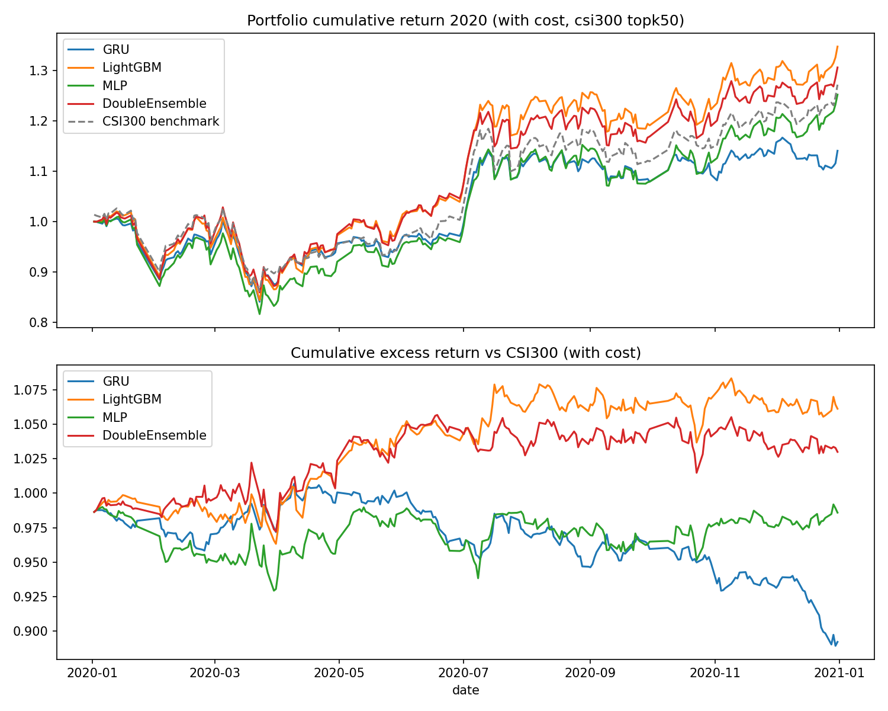
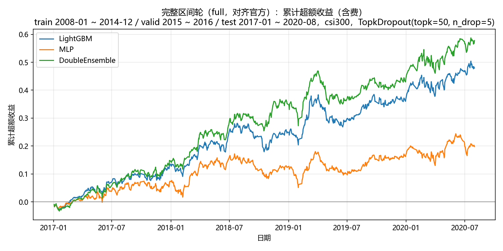

# 基于 microsoft/qlib 的模型对比实验

## 目前已完成的实验：冒烟测试LightGBM / DoubleEnsemble / MLP / GRU（qlib / Alpha158 / csi300）；对齐官方 benchmark 的完整复现（LightGBM / DoubleEnsemble / MLP，qlib / Alpha158 / csi300）。

实验报告见 `/report.md`，实验结果可视化：`model-comparison.png`（或最下方图片）

## 后续的实验计划（TODO）：实现一个用 pairwise ranking loss / 加权 IC loss 的模型，在同区间同策略下对比 IC 差异

